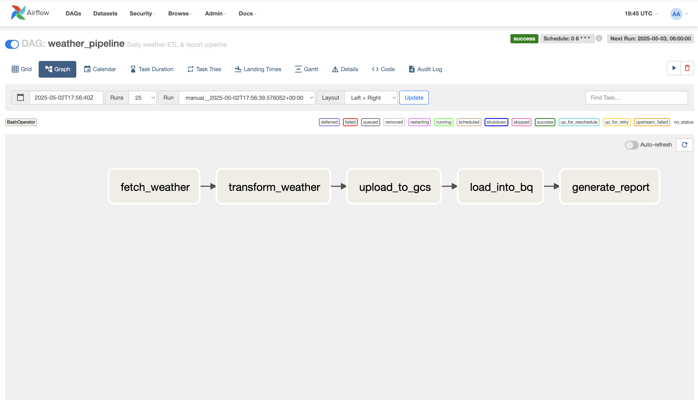
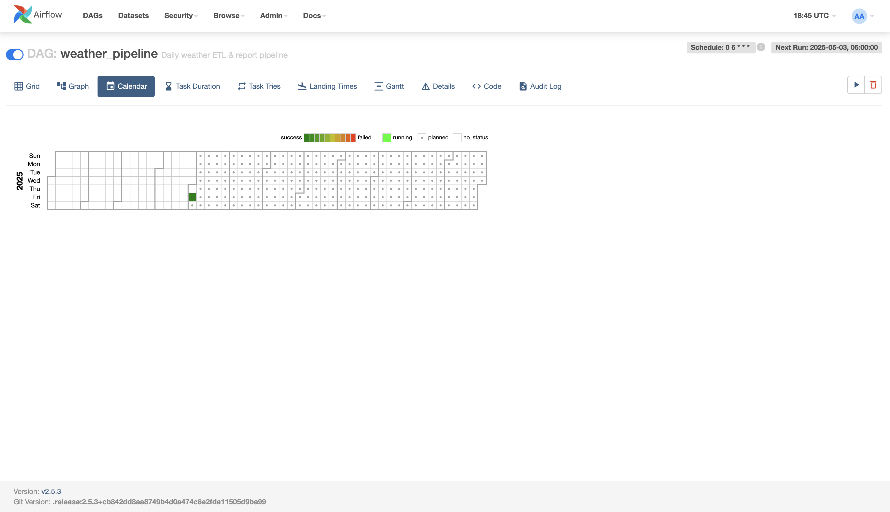

# weather-airflow-pipeline

This project automates a daily weather data pipeline that:
- Fetches weather data from the OpenWeather API
- Transforms and cleans the data
- Uploads it to Google Cloud Storage (GCS)
- Loads it into BigQuery
- Generates a 7-day weather report

| Figure 1. DAG Graph View | Figure 2. DAG Gantt View |
|:--:|:--:|
| <br><em>Graph view of task dependencies</em> | <br><em>Gantt view of task schedule and duration</em> |


## Repository Structure
```text
weather-airflow-pipeline/
├─ airflow/                      # Docker Compose setup for Airflow
│  ├─ dags/                      # Airflow DAGs and scripts
│  │  ├─ weather_pipeline.py     # DAG definition
│  │  └─ scripts/                # ETL scripts
│  │     ├─ fetch_weather_data.py
│  │     ├─ transform_weather_data.py
│  │     ├─ upload_to_gcs.py
│  │     ├─ load_data_to_bigquery.py
│  │     └─ query_last7days.py
│  ├─ docker-compose.yml         # Airflow service configuration
│  ├─ logs/                      # Airflow container logs
│  └─ plugins/                   # Custom Airflow plugins (optional)
├─ .github/                      # GitHub Actions workflows
│  └─ workflows/
│     └─ bq_pipeline.yml         # ETL & report automation
└─ README.md                     # Project overview and instructions
```

## Prerequisites
- Docker Desktop installed and running
- Python 3.9+ (for local script testing, optional)
- A Google Cloud project with:
  - BigQuery Admin role
  - Storage Object Admin role
  - A GCS bucket, e.g., weather-data-bucket-<your-id>
  - A BigQuery dataset named weather_data

## Installation & Launch
### 1) Clone the repository
git clone git@github.com:mingunC/weather-airflow-pipeline.git
cd weather-airflow-pipeline/airflow

### 2) Export your user ID for Airflow file permissions (macOS/Linux)
export AIRFLOW_UID=$(id -u)

### 3) Initialize the database and create the admin user (run once)
docker compose up airflow-init

### 4) Start all services in detached mode
docker compose up -d

### 5) Access the Airflow web UI
    URL: http://localhost:8080
    Login: airflow / airflow

## DAG Registration
1. Place your DAG definition and scripts under:
```text
airflow/dags/
├─ weather_pipeline.py
└─ scripts/
   ├─ fetch_weather_data.py
   ├─ …
```
2. The DAG uses `BashOperator` to call each script via:
`/opt/airflow/dags/scripts/{script_name}.py`

---

## Monitoring

- **Grid View**: Summary of task run status (✔️ success / ❌ failure). Click on a cell → **View Log**.
- **Graph View**: Visualize task dependencies. Click on a node → **View Log**.
- **Calendar View**: Date-wise DAG run status overview.
- **Gantt View**: Timeline view of task start and duration.

---

## Scheduling

- **Daily at 06:00 UTC** via `schedule_interval='0 6 * * *'`
- Manual runs: Click **Trigger DAG** in the UI.

---

## Output Locations

- **GCS** buckets:
- Raw & processed JSON: `gs://weather-data-bucket-<your-id>/weather_data/`
- Reports:          `gs://weather-data-bucket-<your-id>/reports/`
- **BigQuery**:
- Tables named `weather_YYYYMMDD` in dataset `weather_data`
- **Airflow UI**:
- Detailed logs and run history

---

## Cleanup

```bash
docker compose down --volumes
